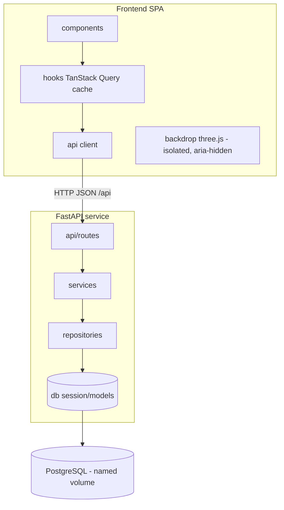
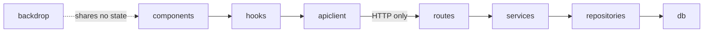
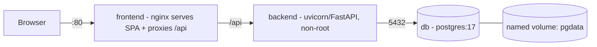
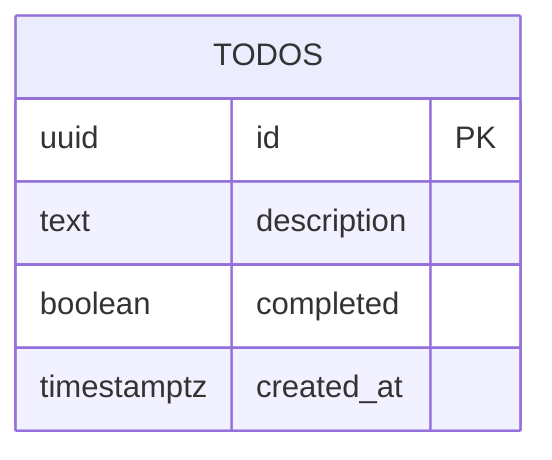

# Architecture Spine — nearform_todo_app

## Design Paradigm

**Three-tier client–server with server-authoritative state.** A React SPA (client cache) sits over a layered FastAPI REST service, which sits over PostgreSQL. The database, reached only through the API, is the single source of truth; the client holds a derivative cache that it updates optimistically and always reconciles back to the server.

Two nested layer models, mapped to directories:

- **Backend (layered):** `api/routes` (HTTP) → `services` (domain rules/validation) → `repositories` (data access, the only place SQL lives) → `db` (SQLAlchemy engine/session/models). Dependencies point downward only.
- **Frontend (component + server-state cache):** presentational `components` render state owned by TanStack Query `hooks`, which talk to a thin typed `api` client. The three.js `backdrop` is a sibling layer that shares no state with the loop.



## Invariants & Rules

Dependency direction (who may depend on whom) — no upward or skip edges except the two shown as allowed:



### AD-1 — Server-authoritative state; all mutation through the API
- **Binds:** all (FR-1..FR-9)
- **Prevents:** divergent client-side state stores, direct DB access from the client, realtime side-channels that bypass the contract.
- **Rule:** PostgreSQL reached via the REST API is the sole source of truth. The client cache is derivative: every mutation is issued to the API and then reconciled against the server response. No unit writes state by any other path.

### AD-2 — Layered backend with a repository chokepoint
- **Binds:** backend
- **Prevents:** SQL leaking into routers, business rules scattered across layers, and the absence of a single place where owner-scoping (AD-9) can later land.
- **Rule:** `routes → services → repositories → db`, dependencies downward only. SQLAlchemy (models, queries, sessions) is confined to `repositories`/`db`; routes and services never import SQLAlchemy query APIs.

### AD-3 — Todo is the only entity; canonical shape and ordering
- **Binds:** all
- **Prevents:** two features inventing different field names, id types, date formats, or list orderings.
- **Rule:** the sole domain entity is `Todo` = `{ id: uuid, description: string, completed: bool, created_at: ISO-8601 UTC ("…Z") }`. The List is ordered `created_at` DESC with `id` as tiebreak (newest first). Toggling completion never reorders or removes a row; completed items stay in place, restyled.

### AD-4 — REST contract on a versionless `/api` base
- **Binds:** frontend + backend
- **Prevents:** divergent endpoint shapes, methods, or status codes between the two units.
- **Rule:** the endpoints, methods, and status codes in [API Contract](#api-contract) are fixed. The static route `DELETE /api/todos/completed` is registered **before** the parametric `DELETE /api/todos/{id}`, and `{id}` is typed as UUID so the two never collide.

### AD-5 — Uniform JSON error envelope and shared validation rules
- **Binds:** all reads/writes
- **Prevents:** per-endpoint error shapes, inconsistent failure handling, and XSS via unsafe rendering.
- **Rule:** every non-2xx response is `{ "error": { "code": string, "message": string, "details"?: [{field, issue}] } }`, produced by centralized FastAPI exception handlers — including a handler that remaps FastAPI's native `RequestValidationError` (which defaults to `422 {detail:[…]}`) into this same envelope, so the client parses one error shape everywhere. `description` is validated identically on both sides: required, whitespace-trimmed, non-empty, single-line (no embedded newlines/control chars), ≤ 500 characters measured on the trimmed string. Todo text is only ever rendered as text (React auto-escaping); it is never interpolated as HTML.

### AD-6 — Optimistic mutation with mandatory rollback and reconcile
- **Binds:** frontend
- **Prevents:** hand-rolled optimistic paths that fail to roll back, and spinners that never resolve.
- **Rule:** all mutations use TanStack Query mutations: `onMutate` snapshots the cache and applies the optimistic change (≤ ~100ms perceived); `onError` rolls back to the snapshot and surfaces a non-blocking inline error (never a modal); `onSettled` invalidates the List query to reconcile to server truth. Every loading state resolves to loaded, empty, or error.

### AD-7 — Clear-completed is a deferred bulk-delete of an explicit id snapshot
- **Binds:** FR-9
- **Prevents:** id/timestamp churn from a re-create model; deleting items completed *during* the undo window; true data loss on a crash mid-window.
- **Rule:** on **Clear completed** the client (1) captures the exact set of currently-completed Todo ids, (2) hides them optimistically, (3) shows the ~6s Undo toast. **Undo** cancels the pending timer with **no server call**. On toast dismiss the client issues **one** `DELETE /api/todos/completed` carrying exactly that id snapshot; the server deletes only those ids that are still completed. Because nothing is deleted server-side until dismiss, a crash/refresh during the window simply restores the items on reload (safe failure), and a Todo completed after the click is never in the snapshot so it is never cleared.

*(Rejected alternative — immediate server delete + compensating re-create on Undo: re-creation mints new ids and loses original `created_at`, risks partial data loss if the re-create fails after the delete succeeds, and needs an extra restore endpoint. Deferred-commit is strictly simpler and safer at single-user scale.)*

### AD-8 — Backdrop is a fully isolated, decorative layer
- **Binds:** FR-8, NFR-Perf, NFR-A11y
- **Prevents:** three.js blocking first paint/input, per-frame React re-renders of the core UI, or the backdrop degrading accessibility or the interaction budget.
- **Rule:** the backdrop is a fixed, full-viewport, `aria-hidden`, `pointer-events:none` layer below the panel. Its three.js code is code-split and mounted **after** the core loop is interactive. It owns its canvas imperatively inside an effect with its own `requestAnimationFrame` loop **outside** React's render cycle; it reads no Todo data. Degradation is mandatory and ordered: `prefers-reduced-motion` → a single static frame (no loop); no WebGL context → the CSS `surface-void → surface-void-far` radial gradient; a frame-budget watchdog steps down device-pixel-ratio then cube count, then falls back to static rather than stutter; the loop pauses on tab `visibilitychange`. An error boundary wraps the backdrop and falls back to the static gradient, so a backdrop failure can never take down the loop.

### AD-9 — Auth / multi-user seam is left open, not built
- **Binds:** data model, API edge, repository
- **Prevents:** building any auth now, **and** a design that would force a rewrite to add it later.
- **Rule:** v1 has no owner column and no auth — a single implicit global List. Future owner-scoping is confined to three additive changes: (a) an Alembic migration adding a `users` table and a `todos.owner_id` FK; (b) an owner filter applied at the single repository chokepoint (AD-2); (c) optional authentication middleware at the `/api` edge. The `Todo` wire contract (AD-3) stays unchanged. `[ASSUMPTION]` No always-null `owner_id` column is added in v1 (YAGNI); the addendum offered it only as an example.

### AD-10 — Single-origin delivery
- **Binds:** delivery, frontend, backend
- **Prevents:** divergent origin/CORS assumptions between dev and production.
- **Rule:** in the composed stack, nginx serves the built SPA and reverse-proxies `/api/*` to the backend, so the browser sees one origin and no CORS is needed. CORS is enabled **only** in the dev profile (via `CORS_ORIGINS`) where the Vite dev server (:5173) calls the backend (:8000).

### AD-11 — Startup and durability ordering
- **Binds:** delivery, backend, db
- **Prevents:** the app serving before its schema exists; data loss across restarts.
- **Rule:** PostgreSQL data lives on a named volume. The backend `depends_on` the db being healthy (`pg_isready`). The backend entrypoint runs `alembic upgrade head` **before** launching Uvicorn. Migrations are additive/non-destructive.

### AD-12 — Synchronous DB access, one session per request
- **Binds:** backend
- **Prevents:** a mix of sync and async DB patterns across endpoints.
- **Rule:** the backend uses synchronous SQLAlchemy 2.0 + psycopg 3; FastAPI runs sync path operations in its threadpool. A single session per request is provided via a FastAPI dependency and closed at request end. No async DB layer in v1 (documented option, not built) given single-user scale.

## Consistency Conventions

| Concern | Convention |
| --- | --- |
| Naming — Python | `snake_case` modules/functions, `PascalCase` classes; table `todos` (plural). |
| Naming — TypeScript | `PascalCase` React components (one per file, matching filename), `camelCase` functions/vars, hooks `useX`. |
| Wire format | JSON, `snake_case` keys (`created_at`) end-to-end; frontend TS types mirror the wire exactly — no field-name mapping layer. |
| Ids | UUID (v4), server-generated (`gen_random_uuid()`); the client uses a temporary local id for an optimistic create, replaced on reconcile. |
| Dates | ISO-8601 UTC with a `Z` suffix; DB column `TIMESTAMPTZ`. |
| Error shape | `{ "error": { "code", "message", "details"? } }` for every non-2xx (AD-5). |
| Success shape | Single resource → the bare `Todo` object; List → `{ "todos": [ … ] }` (envelope leaves room for pagination later). |
| HTTP status | 200 read/update/bulk, 201 create, 204 delete, 400/422 validation, 404 not-found, 500 server. |
| Config | 12-factor env vars only; backend via `pydantic-settings`; frontend build-time `VITE_*`. No secrets in v1. |
| Logging | Structured JSON to stdout (both services); one line per request with a request id; viewable via `docker-compose logs`. |
| Tests | Backend `pytest` in `backend/tests/{unit,integration}`; frontend Vitest colocated `*.test.tsx`; Playwright specs in `e2e/`. |

## API Contract

Base path `/api`. All bodies and responses are JSON (`snake_case`). Errors use the AD-5 envelope.

`Todo` (response): `{ "id": "<uuid>", "description": "<string>", "completed": <bool>, "created_at": "<iso8601-utc>" }`

| Method & Path | Request body | Success | Errors | Notes |
| --- | --- | --- | --- | --- |
| `GET /api/health` | — | `200 { "status": "ok", "db": "ok" }` | `503` if DB unreachable | Liveness + readiness (checks a DB round-trip). |
| `GET /api/todos` | — | `200 { "todos": [Todo, …] }` | `500` | Ordered `created_at` DESC, id tiebreak (AD-3). |
| `POST /api/todos` | `{ "description": string }` | `201 Todo` | `422` invalid description | Trims; rejects empty/whitespace-only, multi-line, > 500 chars (AD-5). New Todo: `completed=false`, server-set `created_at`. |
| `PATCH /api/todos/{id}` | `{ "completed": bool }` | `200 Todo` | `404` missing, `422` invalid | Only `completed` is mutable in v1 (no text editing). Toggles both directions (FR-2). |
| `DELETE /api/todos/{id}` | — | `204` | `404` missing | Permanent, no undo (FR-3). Client treats `404` as already-gone and reconciles. |
| `DELETE /api/todos/completed` | `{ "ids": [uuid, …] }` (optional) | `200 { "deleted": <int> }` | `500` | Bulk clear (FR-9, AD-7). When `ids` given, deletes only those that are still completed; when omitted, deletes all completed. Client always sends the snapshot. Registered before `/{id}`. |

**Validation rules (server-side, mirrored client-side):** `description` required; trimmed; non-empty; single-line (no newline/control chars); ≤ 500 chars on the trimmed string. Violations return `422` with `details` naming the field and issue. Microcopy is owned by the UX spine, not the API.

## Stack

| Name | Version |
| --- | --- |
| Python | 3.12 `[ASSUMPTION]` |
| FastAPI | 0.136.x |
| Pydantic / pydantic-settings | 2.x |
| SQLAlchemy | 2.0.x (sync) |
| psycopg | 3.x |
| Alembic | current (~1.14+) |
| Uvicorn | 0.34.x |
| pytest / pytest-cov | current |
| Node.js | 22 LTS `[ASSUMPTION]` |
| React | 19.2.x |
| Vite | 8.0.x |
| TypeScript | 5.x |
| three.js | 0.185.x |
| TanStack Query | v5 |
| Vitest / @testing-library/react | 4.x / current |
| Playwright / @axe-core/playwright | 1.5x / current |
| PostgreSQL | 17 |
| nginx | stable-alpine |

## Structural Seed

### Container topology



Three containers via `docker-compose up`: `frontend`, `backend`, `db`. Multi-stage Dockerfiles (frontend: node build → nginx runtime; backend: deps → slim runtime, non-root user). Each service declares a Docker `healthcheck`: `db` via `pg_isready`, `backend` via `GET /api/health`, `frontend` via nginx `GET /` returning 200. Compose **profiles**: `dev` (source mounts, Vite HMR, exposed ports, CORS on) and `test` (ephemeral DB, runs the suites). `db` waits healthy before `backend`; `backend` migrates before serving (AD-11).

### Data model

Single table `todos` (Alembic-managed):



`id` UUID PK default `gen_random_uuid()`; `description` `TEXT NOT NULL` with `CHECK (char_length(description) BETWEEN 1 AND 500)`; `completed` `BOOLEAN NOT NULL DEFAULT false`; `created_at` `TIMESTAMPTZ NOT NULL DEFAULT now()`. Index on `created_at DESC` for ordering. No `owner_id` in v1 — the auth seam is AD-9.

### Source tree

```text
nearform_todo_app/
  backend/
    app/
      main.py              # app factory, exception handlers, router mount
      api/routes/todos.py  # /api/todos endpoints
      api/routes/health.py # /api/health
      core/config.py       # pydantic-settings (env)
      core/logging.py      # JSON stdout logging
      db/session.py        # engine + per-request session dependency
      db/models.py         # SQLAlchemy Todo
      repositories/todo_repo.py  # data-access chokepoint (owner seam)
      services/todo_service.py   # validation + domain rules
      schemas/todo.py      # pydantic request/response
    migrations/            # alembic
    tests/{unit,integration}/
    Dockerfile
    pyproject.toml
  frontend/
    src/
      main.tsx  App.tsx
      api/client.ts  api/todos.ts     # typed fetch wrapper
      hooks/useTodos.ts                # TanStack Query queries + mutations
      components/{AddInput,TodoList,TodoRow,FooterBar,UndoToast,InlineError,SkeletonRows,EmptyState}.tsx
      backdrop/{Backdrop.tsx,scene.ts} # isolated three.js (code-split)
      types.ts  styles/
      **/*.test.tsx                    # Vitest colocated
    Dockerfile  nginx.conf
    package.json  vite.config.ts  vitest.config.ts
  e2e/
    tests/*.spec.ts  playwright.config.ts
  docker-compose.yml
  README.md
  docs/AI-INTEGRATION-LOG.md
```

## Capability → Architecture Map

| Capability / FR | Lives in | Governed by |
| --- | --- | --- |
| FR-1 Create | `POST /api/todos`; `AddInput`, `useTodos` | AD-3, AD-4, AD-5, AD-6 |
| FR-2 Toggle complete | `PATCH /api/todos/{id}`; `TodoRow`, `Checkbox` | AD-3, AD-6 |
| FR-3 Delete | `DELETE /api/todos/{id}`; `TodoRow` | AD-4, AD-6 |
| FR-4 View on open | `GET /api/todos`; `App`, `useTodos` | AD-1, AD-4 |
| FR-5 Ordering | repository query; List render | AD-3 |
| FR-9 Clear completed | `DELETE /api/todos/completed`; `FooterBar`, `UndoToast` | AD-7 |
| FR-6 Empty/loading | `SkeletonRows`, `EmptyState` | AD-6 |
| FR-7 Error/graceful | exception handlers; `InlineError`, error boundary | AD-5, AD-6 |
| FR-8 Backdrop + fallbacks | `backdrop/` | AD-8 |
| NFR-Perf | optimistic cache; backdrop isolation | AD-6, AD-8 |
| NFR-A11y | scrim panel, keyboard order, aria-hidden backdrop | AD-8 + UX spine |
| NFR-Rel | named volume; reconcile-on-settle | AD-1, AD-11 |
| NFR-Deploy | 3-container compose, health, profiles | AD-10, AD-11 |
| NFR-Sec | server validation, parameterized queries, text-only render | AD-2, AD-5 |
| NFR-Maint | repository chokepoint, stable contract | AD-2, AD-9 |

## Testing Architecture

- **Backend unit** (`backend/tests/unit`, pytest): services/validation logic, error mapping. Fast, no DB.
- **Backend integration** (`backend/tests/integration`, pytest + FastAPI `TestClient`/httpx): every endpoint against a **real Postgres**, each test wrapped in a transaction rolled back after. Validates the AD-4 contract and AD-5 envelope.
- **Frontend unit/component** (Vitest + Testing Library): components, `useTodos` optimistic/rollback/reconcile paths (AD-6), the api client, and backdrop fallback selection (reduced-motion, no-WebGL) via mocked matchMedia/WebGL.
- **E2E** (`e2e/`, Playwright, ≥ 5 specs) against the running compose stack: create, complete, delete, clear-completed + undo, empty state, and a load/action error path. `@axe-core/playwright` asserts **zero critical WCAG 2.1 AA violations** with the backdrop active (SM-4).
- **Coverage:** pytest-cov (backend) and Vitest v8 coverage (frontend), gated at **≥ 70% meaningful coverage** (SM-5).
- **Wiring:** each package exposes `test`/`coverage` scripts; a root Makefile (or npm scripts) runs backend + frontend + a compose-backed Playwright run, so one command reproduces CI locally.

## Deferred

- **CI provider & pipeline** — RESOLVED (human): **GitHub Actions** (lint, test, coverage, build). Commands stay wired CI-agnostically (package scripts + Makefile); the GitHub Actions workflow calls those.
- **Exact numeric perf budgets & representative test devices** — carried as working defaults from PRD Open Questions 5–7 (~100ms optimistic, API p95 < 300ms, ~60fps backdrop with step-down); confirmed during the performance pass.
- **Integration-test DB mechanism** — RESOLVED (human): **transactional-rollback fixtures** against a compose `test`-profile Postgres (testcontainers not used).
- **Auth / multi-user** — seam defined (AD-9), nothing built. Revisit when a second user is a real requirement.
- **Backend async DB, pagination, rate limiting, PWA/offline** — not needed at single-user v1 scale; conventions leave room (envelope List shape, repository chokepoint).
- **three.js visual tuning** (cube count/density/colours, DPR caps per device) — owned by the code + the UX/perf pass, within the AD-8 guardrails.
